```mermaid
flowchart LR
    A["Sensors"] --> B["Perception"]
    B --> C["SIS‑10\nSemantic Interpretation"]
    C --> D["SIF‑10\nSemantic Influence"]
    D --> E["MCM‑10\nMeaning Classification"]
    E --> F["TIER‑10\nTier Assignment"]
    F --> G["SICM‑10\nSemantic Intensity Scoring"]
    G --> H["DIFS‑10\nDrift & Fading"]
    H --> I["QFIM‑10\nQualified Interpretation"]
    I --> J["Fusion\nCross‑Sensor Meaning"]
    J --> K["Planning\nTask + Motion"]
    K --> L["Control\nExecution Layer"]
    L --> M["AMD‑10\nMeaning Diagnostics"]
```

Description Block
Sensors — Raw signals from cameras, LiDAR, radar, IMU, tactile sensors.
Perception — Converts raw signals into structured observations.
SIS‑10 — Interprets observations into semantic descriptors.
SIF‑10 — Assigns influence weights to semantic attributes.
MCM‑10 — Classifies attributes into semantic roles (MD, ME, MX, MN).
TIER‑10 — Assigns governance tiers (E, EC, C, CN, N).
SICM‑10 — Computes semantic intensity scores (0–100).
DIFS‑10 — Models drift and fading over time or uncertainty.
QFIM‑10 — Produces qualified interpretation levels.
Fusion — Cross‑sensor semantic integration.
Planning — Task and motion planning constrained by semantic meaning.
Control — Executes actions with semantic‑aware modulation.
AMD‑10 — Detects semantic failures, contradictions, and collapse.
