```mermaid
flowchart LR
    A["Sensors"] --> B["Perception"]
    B --> C["SIS‑10\nSemantic Interpretation"]
    C --> D["SIF‑10\nSemantic Influence"]
    D --> E["MCM‑10\nMeaning Classification"]
    E --> F["TIER‑10\nTier Assignment"]
    F --> G["SICM‑10\nSemantic Intensity Scoring"]
    G --> H["DIFS‑10\nDrift & Fading"]
    H --> I["QFIM‑10\nQualified Interpretation"]
    I --> J["Fusion\nCross‑Sensor Meaning"]
    J --> K["Planning\nTask + Motion"]
    K --> L["Control\nExecution Layer"]
    L --> M["AMD‑10\nMeaning Diagnostics"]
```

Description Block
Sensors — Raw signals from cameras, LiDAR, radar, IMU, tactile sensors.
Perception — Converts raw signals into structured observations.
SIS‑10 — Interprets observations into semantic descriptors.
SIF‑10 — Assigns influence weights to semantic attributes.
MCM‑10 — Classifies attributes into semantic roles (MD, ME, MX, MN).
TIER‑10 — Assigns governance tiers (E, EC, C, CN, N).
SICM‑10 — Computes semantic intensity scores (0–100).
DIFS‑10 — Models drift and fading over time or uncertainty.
QFIM‑10 — Produces qualified interpretation levels.
Fusion — Cross‑sensor semantic integration.
Planning — Task and motion planning constrained by semantic meaning.
Control — Executes actions with semantic‑aware modulation.
AMD‑10 — Detects semantic failures, contradictions, and collapse.

Description of Each Stage
Sensors
Raw signals from cameras, LiDAR, radar, IMU, tactile sensors, microphones, encoders.

Perception
Transforms raw sensor data into structured observations (objects, poses, features).

SIS‑10 — Semantic Interpretation System
Converts observations into semantic descriptors:

Meaning roles

Tiers

Initial semantic scores

This is where meaning enters the pipeline.

SIF‑10 — Semantic Influence Framework
Assigns influence weights to each semantic attribute based on:

role

tier

score

context

Ensures Meaning‑Defining attributes dominate.

MCM‑10 — Meaning Classification Model
Classifies attributes into:

MD (Meaning‑Defining)

ME (Meaning‑Enhancing)

MX (Meaning‑Extending)

MN (Meaning‑Neutral)

TIER‑10 — Tier Assignment System
Maps semantic roles into governance tiers:

Essential → Semi‑Essential → Contextual → Semi‑Contextual → Non‑Essential

SICM‑10 — Semantic Intensity Continuum Model
Assigns a 0–100 semantic intensity score based on tier and context.

DIFS‑10 — Drift & Fading Subzones
Models semantic decay over time or uncertainty using exponential fading.

QFIM‑10 — Qualified Interpretation Model
Produces a qualified meaning level:
Critical → High → Moderate → Low → Minimal

Fusion
Combines meaning across sensors using weighted semantic influence.

Planning
Task and motion planning constrained by semantic meaning and safety tiers.

Control
Executes trajectories with semantic‑aware modulation (e.g., cautious near humans).

AMD‑10 — Automated Meaning Diagnostics
Detects:

missing Essential meaning

contradictions

drift failures

semantic collapse

This closes the loop for safety and governance.
