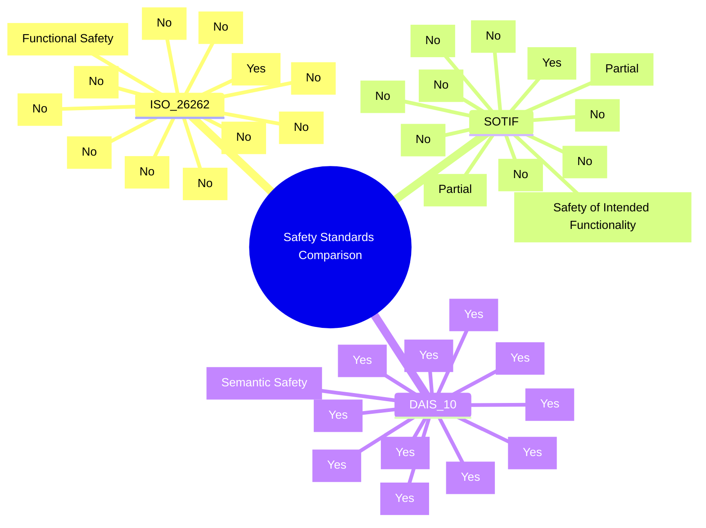
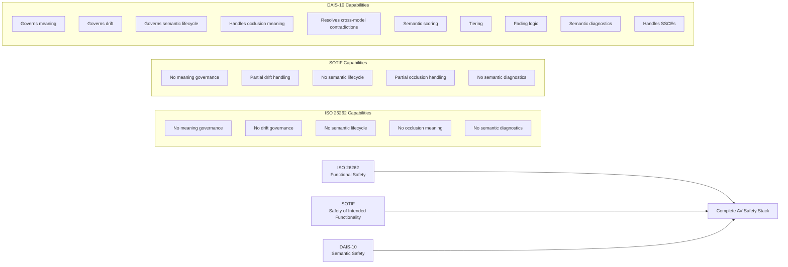

```text
+----------------------------------------+-------------+-------------------------------+-------------+
|                Dimension               | ISO 26262   |            SOTIF              |   DAIS‑10   |
+----------------------------------------+-------------+-------------------------------+-------------+
| Focus                                  | Functional  | Safety of Intended            | Semantic    |
|                                        | Safety      | Functionality                 | Safety      |
+----------------------------------------+-------------+-------------------------------+-------------+
| Governs meaning                        | No          | No                            | Yes         |
+----------------------------------------+-------------+-------------------------------+-------------+
| Governs drift                          | No          | Partial                       | Yes         |
+----------------------------------------+-------------+-------------------------------+-------------+
| Governs semantic lifecycle             | No          | No                            | Yes         |
+----------------------------------------+-------------+-------------------------------+-------------+
| Handles occlusion meaning              | No          | Partial                       | Yes         |
+----------------------------------------+-------------+-------------------------------+-------------+
| Handles cross‑model contradictions     | No          | No                            | Yes         |
+----------------------------------------+-------------+-------------------------------+-------------+
| Provides semantic scoring              | No          | No                            | Yes         |
+----------------------------------------+-------------+-------------------------------+-------------+
| Provides tiering                       | No          | No                            | Yes         |
+----------------------------------------+-------------+-------------------------------+-------------+
| Provides fading logic                  | No          | No                            | Yes         |
+----------------------------------------+-------------+-------------------------------+-------------+
| Provides semantic diagnostics          | No          | No                            | Yes         |
+----------------------------------------+-------------+-------------------------------+-------------+
| Handles SSCEs                          | No          | No                            | Yes         |
+----------------------------------------+-------------+-------------------------------+-------------+
| Complements AV stack                   | Yes         | Yes                           | Yes         |
+----------------------------------------+-------------+-------------------------------+-------------+
```


